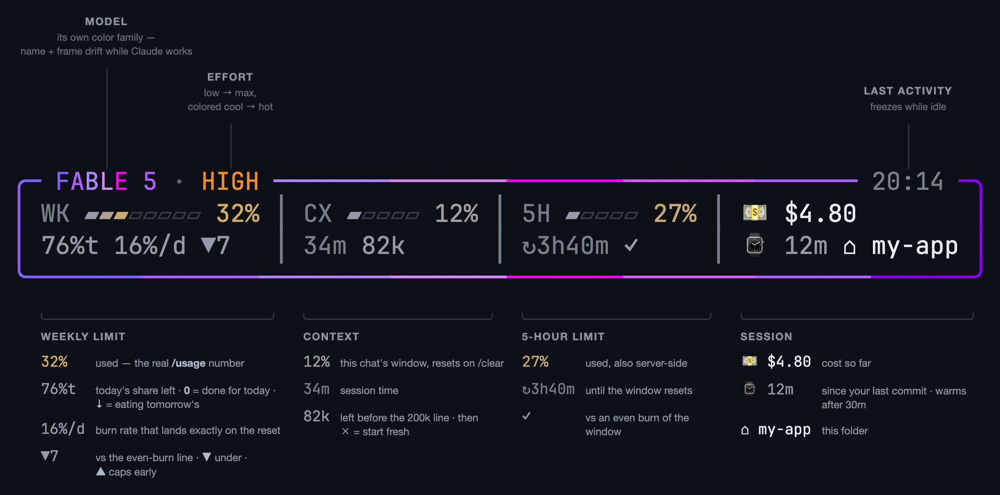
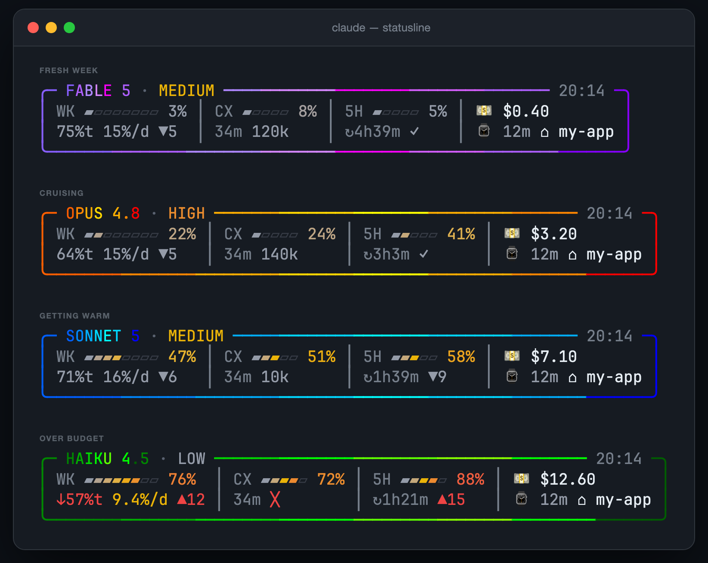

<div align="center">

# claude-statusline-burnrate

**Stop opening `/usage`. It's all right there.**




</div>

Real server-side `rate_limits` — the same numbers `/usage` shows — answers what you actually want: **am I ok, and how hard can I push?** Pure bash + jq. No node, no daemons, no estimates.

The pacing math counts awake hours, so the trend doesn't fall "behind" every night while you sleep.

## Install

Needs `jq` and Claude Code v2.1+.

**Easiest** — you already have an AI open. Paste this into Claude Code:

```text
Install the status line from github.com/Gui-Gou/claude-statusline-burnrate: download
https://raw.githubusercontent.com/Gui-Gou/claude-statusline-burnrate/main/statusline.sh
to ~/.claude/statusline.sh, chmod +x it, then set statusLine to
{"type":"command","command":"~/.claude/statusline.sh"} in ~/.claude/settings.json
without touching my other settings.
```

Using the Antigravity CLI too? Add "and the same statusLine in ~/.gemini/antigravity-cli/settings.json" to the prompt (see [below](#antigravity-cli-agy)).

**By hand** — two commands:

```bash
curl -fsSL https://raw.githubusercontent.com/Gui-Gou/claude-statusline-burnrate/main/statusline.sh -o ~/.claude/statusline.sh
chmod +x ~/.claude/statusline.sh
```

Then add to `~/.claude/settings.json`:

```json
{
  "statusLine": { "type": "command", "command": "~/.claude/statusline.sh" }
}
```

Open a new session. That's it.

## Antigravity CLI (`agy`)

The same script works as the status line of Google's Antigravity CLI. Needs `jq`, `python3` and `agy`.

Already installed for Claude Code? Skip the download and just add the setting below. Otherwise:

```bash
mkdir -p ~/.claude
curl -fsSL https://raw.githubusercontent.com/Gui-Gou/claude-statusline-burnrate/main/statusline.sh -o ~/.claude/statusline.sh
chmod +x ~/.claude/statusline.sh
```

Then add to `~/.gemini/antigravity-cli/settings.json`:

```json
{
  "statusLine": { "type": "command", "command": "~/.claude/statusline.sh" }
}
```

agy's payload carries no `rate_limits`, so the script falls back to `agy -p "/usage"`: parsed with `python3`, refreshed in the background every 3 min, and cached in `~/.claude/.cache/agy-quota.cache`. Gemini models use the Gemini quota, Claude/GPT models the other one. The effort comes from the model name (`Gemini 3.8 Flash (High)`), and Gemini Flash ⚡, Gemini Pro ✨ and GPT 🪐 get their own mascot and colors.

| Variable | Default | |
|---|---|---|
| `SL_AGY_BIN` | `agy` on `PATH`, else `~/.local/bin/agy` | Path to the agy binary |
| `SL_AGY_TTL` | `180` | Seconds between background `/usage` refreshes |

In Claude Code, `rate_limits` are present, so the fallback never runs.

## Try it first

```bash
git clone https://github.com/Gui-Gou/claude-statusline-burnrate && cd claude-statusline-burnrate
./demo.sh          # the four states below, fake data
./demo.sh --live   # animated
```



## Tweak

| Variable | Default | |
|---|---|---|
| `SL_DAY_START` | `2` | Hour your day flips (2 = 2am) |
| `SL_SLEEP_HOURS` | `6` | Hours after that spent asleep — zero-weight in the pacing math |

Colors, thresholds, mascots, cat moods: each is a short `case` block in ~300 lines of commented bash. Make it yours.

---

A ⭐ helps the next dev find it before a rate-limit panic.

MIT
