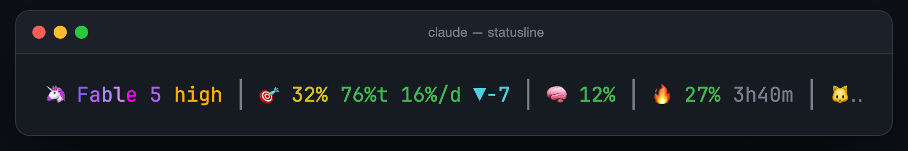

<div align="center">

# claude-statusline-burnrate

**Stop opening `/usage`. It's all right there.**


</div>

Real server-side `rate_limits` — the same numbers `/usage` shows — answers what you actually want: **am I ok, and how hard can I push?** Pure bash + jq. No node, no daemons, no estimates.

The pacing math counts awake hours, so the trend doesn't fall "behind" every night while you sleep. And the colors stay gray until something needs you: only a meter that has actually warmed up gets to pull your eye.

## Install

Needs `jq` and Claude Code v2.1+.

**Easiest** — you already have an AI open. Paste this into Claude Code:

```text
Install the status line from github.com/Gui-Gou/claude-statusline-burnrate: download
https://raw.githubusercontent.com/Gui-Gou/claude-statusline-burnrate/main/statusline.sh
to ~/.claude/statusline.sh, chmod +x it, then set statusLine to
{"type":"command","command":"~/.claude/statusline.sh"} in ~/.claude/settings.json
without touching my other settings.
```

Using the Antigravity CLI too? Add "and the same statusLine in ~/.gemini/antigravity-cli/settings.json" to the prompt (see [below](#antigravity-cli-agy)).

**By hand** — two commands:

```bash
curl -fsSL https://raw.githubusercontent.com/Gui-Gou/claude-statusline-burnrate/main/statusline.sh -o ~/.claude/statusline.sh
chmod +x ~/.claude/statusline.sh
```

Then add to `~/.claude/settings.json`:

```json
{
  "statusLine": { "type": "command", "command": "~/.claude/statusline.sh" }
}
```

Open a new session. That's it.

## Try it first

```bash
git clone https://github.com/Gui-Gou/claude-statusline-burnrate && cd claude-statusline-burnrate
./demo.sh             # the four states below, fake data
./demo.sh --live      # animated tour: meters sweep, models cycle
./demo.sh --classic   # the one-line v1
```


## Prefer one line?

v1 is still here as `statusline-classic.sh`: same math, one row, emoji labels and an animated cat whose mood follows the worst meter.



```bash
curl -fsSL https://raw.githubusercontent.com/Gui-Gou/claude-statusline-burnrate/main/statusline-classic.sh -o ~/.claude/statusline.sh
chmod +x ~/.claude/statusline.sh
```

Upgrading from v1: re-running the install gives you the card. The card is about 65 columns wide, so on a narrow terminal the classic line fits better.

## Antigravity CLI (`agy`)

Both scripts also work as the status line of Google's Antigravity CLI. Needs `jq`, `python3` and `agy`.

Already installed for Claude Code? Skip the download and just add the setting below. Otherwise:

```bash
mkdir -p ~/.claude
curl -fsSL https://raw.githubusercontent.com/Gui-Gou/claude-statusline-burnrate/main/statusline.sh -o ~/.claude/statusline.sh
chmod +x ~/.claude/statusline.sh
```

Then add to `~/.gemini/antigravity-cli/settings.json`:

```json
{
  "statusLine": { "type": "command", "command": "~/.claude/statusline.sh" }
}
```

Antigravity CLI (agy v1.2+) sends server-side quota directly via `.quota` in the statusLine payload, so the script reads it natively in pure bash + jq on every render — zero background subshells, zero lag, exact floating-point precision. On older agy releases where `.quota` is absent, it transparently falls back to parsing `agy -p "/usage"` cached in the background every 3 min (`~/.claude/.cache/agy-quota.cache`). Gemini models track the Gemini quota, Claude/GPT models the 3p quota. Effort is detected automatically (`.model.effort` or `(High)`), Gemini Flash, Gemini Pro and GPT get dedicated color palettes (and mascots in the classic line: ⚡ ✨ 🪐), and the plan tier appears cleanly in the card (e.g. `✦ AI Pro`).

In Claude Code, native `rate_limits` are present, so neither fallback is ever triggered.

## Tweak

| Variable | Default | |
|---|---|---|
| `SL_DAY_START` | `2` | Hour your day flips (2 = 2am) |
| `SL_SLEEP_HOURS` | `6` | Hours after that spent asleep — zero-weight in the pacing math |
| `SL_STATUS` | `1` | `0` stops the background check of status.claude.com (a 🔥 appears only during an incident) |
| `SL_TASKS` | `0` | `1` counts open / in-progress / blocked items in `project-management/TASKS.md` in place of the cost |
| `SL_AGY_BIN` | `agy` on `PATH`, else `~/.local/bin/agy` | Path to the agy binary |
| `SL_AGY_TTL` | `180` | Seconds between background agy `/usage` refreshes |

Colors, thresholds and layout are short, commented blocks of bash. Make it yours.

---

A ⭐ helps the next dev find it before a rate-limit panic.

MIT
